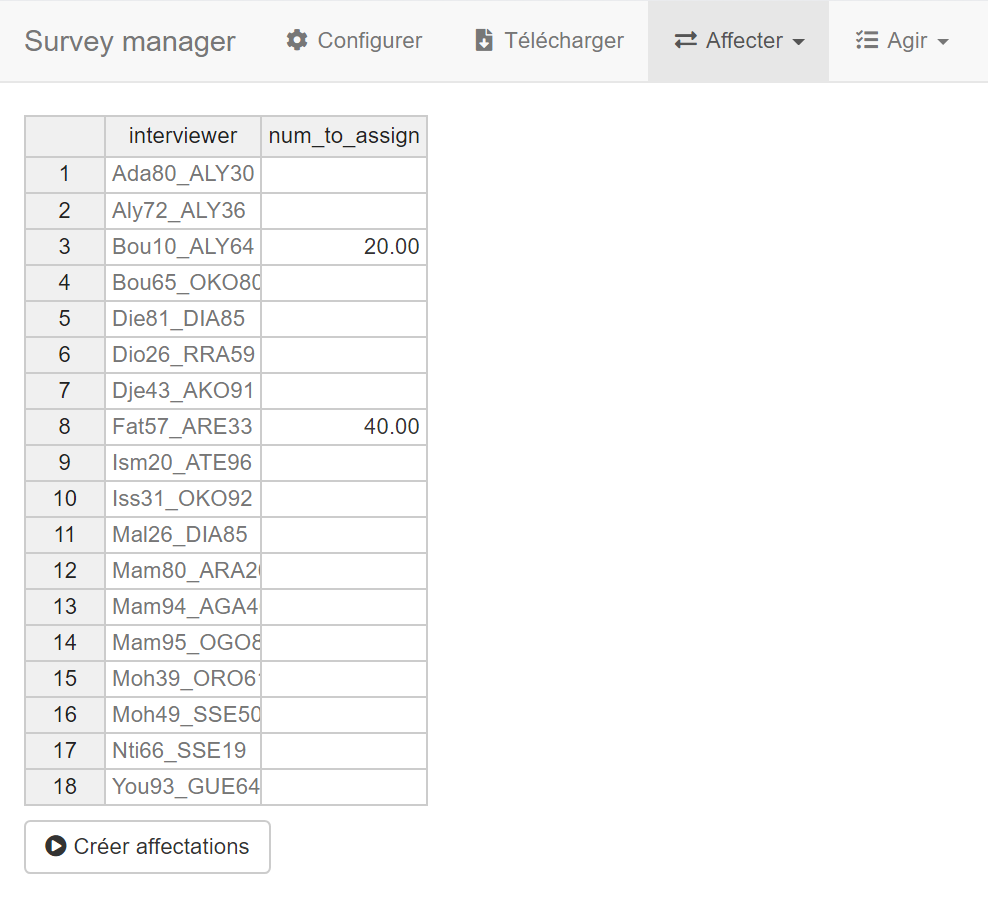
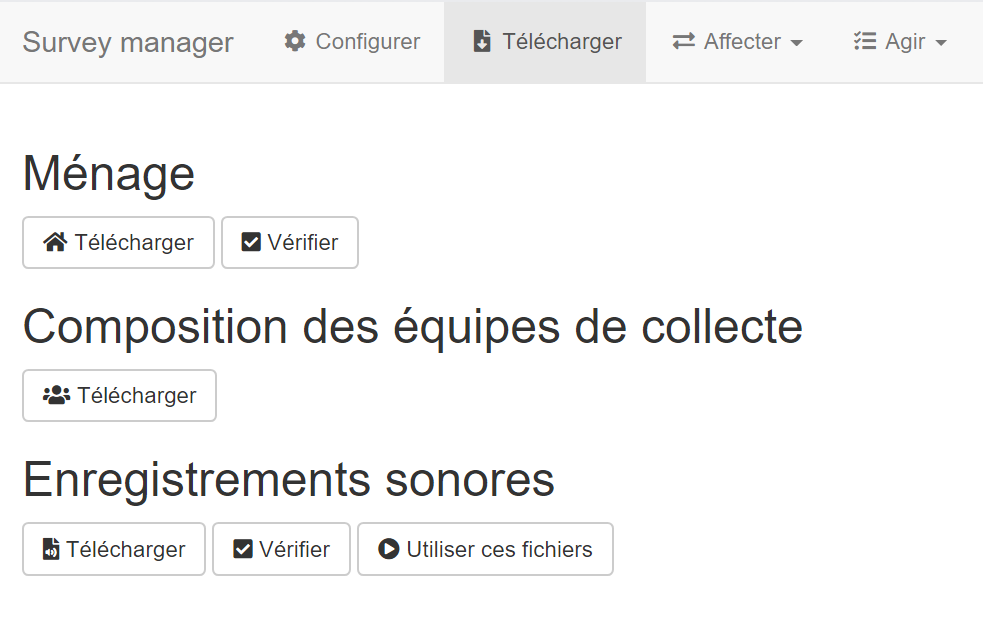
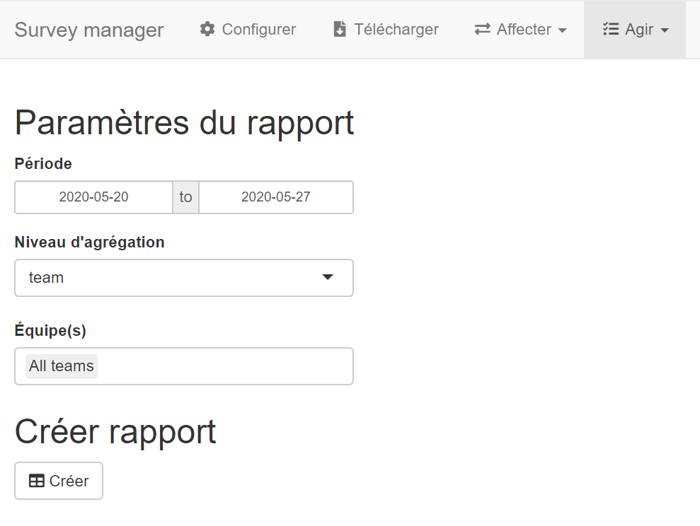
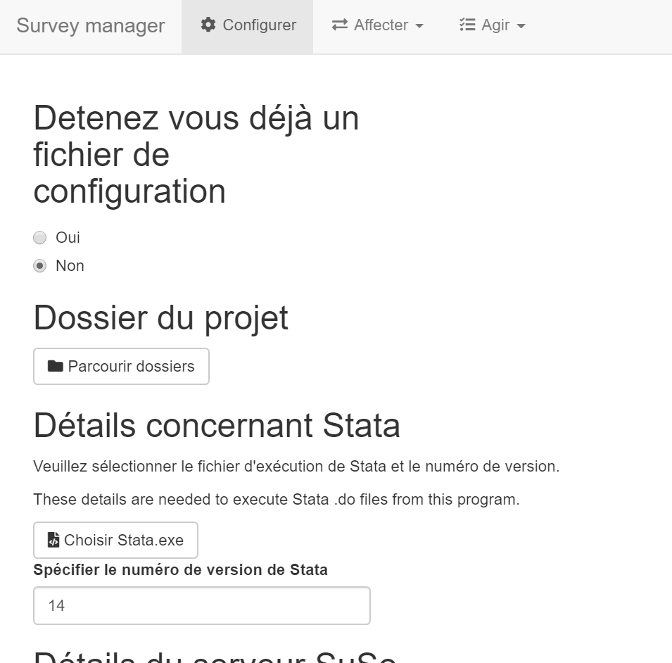

# Survol

Une application qui facilite les tâches de gestion d'enquête:

- Affectation d'entretiens avec informations préchargées
- Téléchargement des données
- Création de rapport de suivi

Affecter            |  Télécharger | Surveiller   
:--------------:|:-----------:|:-------------------------:
  |  | 

#  Table des matières:

- [Installation](#installation)
- [Utilisation](#utilisation)
    - [Affecter des entretiens](#affecter-des-entretiens)
    - [Télécharger les données](#télécharger-les-données)
    - [Approuver/rejeter](#approuverrejeter)
    - [Surveiller](#surveiller)

# Installation

Veuillez suivre les étapes suivantes, même si vous avez déjà une installation de R de RStudio sur votre machine:

- [Télécharger ce répositoire](#télécharger-ce-répositoire)
- [Installer R](#installer-r)
- [Installer RStudio](#installer-rstudio)

## Télécharger ce répositoire

- Cliquer sur le bouton `Clone or download`
- Cliquer sur l'option `Download ZIP`
- Télécharger dans le dossier sur votre machine où vous voulez héberger ce projet

## Installer R

- Suivre [ce lien](https://cran.rstudio.com/)
- Cliquer sur le lien approprié pour votre système d'exploitation
- Cliquer sur `base`
- Télécharger et installer

## Installer RStudio

- Suivre [ce lien](https://www.rstudio.com/products/rstudio/download/)
- Sélectionner RStudio Desktop Open Source License
- Cliquer sur le lien approprié pour votre système d'exploitation
- Télécharger et installer

# Configuration

## Mettre en place les fichiers requis

Copier les fichiers requis dans le répertoire suivant: `/survey-manager/programs/assign-hholds/data/`

Confirmer que les bases avec un identifiant ménage ont le même identifiant avec le même nom dans chaque base de sorte à permettre la fusion.

L'application a besoin des bases suivantes :

- **Échantillon.** Consiste des ménages sélectionnés. Besoin d'une seule variable: l'identifiant ménage. Ne pas inclure les ménages non-sélectionnés.
- **Ménage.** Consiste des attributs à précharger au niveau ménage. Au minimum, contient l'identifiant ménage, les contacts téléphonique, l'interlocuteur pour chaque contact, et la langue de l'entretien. Pour l'EHCVM, correspond à la base `s00_me_[PAYS][ANNEE].dta`.
- **Membres du ménage.** Consiste des infos à précharger au niveau des membres du ménage. Au minimum, contient, l'identifiant ménage, l'identifiant membre, et le nom du membre. Pour l'EHCVM, correspond à la base `s01_me_[PAYS][ANNEE].dta`.
- **Enquêteurs et des langues parlées.** Contient une liste des enquêteurs en une colonne et les langues parlées en plusieurs colonnes. La colonne des enquêteurs doit s'appeller `login` et contenir le login du compte d'enquêteur. Les colonnes de langues doivent suivre ce format: `s00q28_[valeur] (Nom de la langue)`, où `[valeur]` correspond à la valeur dans la variable de la langue d'interview dans la base ménage (i.e., `s00q28` dans l'EHCVM). Les cellules doivent contenir un `1`, un `0`, ou un vide. Voir un exemple du Mali ici-bas:

## Configurer par l'application

- Ouvrir RStudio
- Ouvrir `survey_manager.R` par le menu `File > Open File`
- Lancer l'appli en cliquant sur le bouton `Run app`

Ensuite, indiquer ne pas détenir un fichier de configuration afin de pouvoir renseigner les paramètres requis

Les sections suivantes donnent des indications de la nature des valeurs recherchées ou de comment les renseigner.

### Dossier du projet

Pour que l'application marche, il faut qu'elle sache se localiser sur votre machine. Indiquer la localisation en choissisant le dossier `survey_manager` dans l'interface suivante. Le panneau de gauche indique les répertoires. Le panneau de droite indique le contenu du répertoire sélectionné.

### Détails de Stata

Pour que l'application puisse se servir de Stata pour certaines tâches--par exemple, la fusion de bases Stata--il faut qu'elle sache où trouver l'installation Stata sur votre machine. Pour ce faire, retrouver le fichier exécutable de Stata avec l'interface suivante.

Pour changer de volumes, cliquer sur la liste déroulante en haut et à droite de l'interface

### Détails du serveur SuSo

#### Identifiants de connexion

Pour permettre l'appli d'accèder à votre serveur afin d'accomplir certaines actions, reseigner:

- **Site.** Pour un serveur à l'adresse https://demo.mysurvey.solutions, il s'agit de `demo`.
- **Login, mot de passe.** Renseigner le login et mot de passe d'un utilisateur API. Si un utilisateur API n'existe pas déjà, se connecter au serveur en tant qu'admin pour en créer un.

#### Questionnaires

Pour télécharger les données de certains masques, renseigner le nom--ou une expression régulière--permettant de les identifier. Pour les cas simples, il pourrait s'agir simplement du nom du masque. Pour des cas moins simples, il pourrait s'agir d'un sous-texte qui identifie plusieurs masques du même type.

Il est prévu d'avoir trois bases, chacune provenant d'une application séparée:

- **Ménage.** Application CATI administrée aux ménages.
- **Entretien de rappel.** Application facultative pour réaliser des vérifications auprès des ménages déclarés comme étant enquêtés. Même si elle n'existe pas, il faut renseigner un texte quelconque.
- **Entretien de répondant secret.** Application facultative pour réaliser des entretiens avec de faux répondants afin d'observer la manière dont l'enquêteur fait ses entretiens. Même si elle n'existe pas, il faut renseigner un texte quelconque.

### Détails sur les fichiers de préchargement

Pour les [fichiers impliqués dans le préchargement](#mettre-en-place-les-fichiers-requis), il faut donner le nom--avec extension--donner leur nom et, par moment, des informations concernant certaines variables clé.

### Détails sur les données exportées

Pour que certains composants de l'application--notamment, les rapports et le rejet--sachent quelles bases utiliser, il faut en indiquer les noms. Pour l'EHCVM, les valeurs sont pré-remplies.

### Détails sur le programme de rejet

Pour que l'application sache quels entretiens traîter pour le rejet, il faut identifier les entretiens achevés par deux moyens complémentaires:

- Statut(s) dans Survey Solutions
- Statut selon le bilan de l'entretien dans la base ménage

Pour l'EHCVM, les valeurs de ce dernier sont pré-remplies.

### Période de collecte

Indiquer les dates de début et de fin de la vague de collecte en cours.

### Sauvegarder

Sauvegarder les paramètres. Une fois le bouton appuyé, l'application va créer un fichier `setup_params.R` qui capte les informations fournies et les stocke pour les prochaines séances d'utilisation de l'application.

# Utilisation

## Configuration

Charger le fichier `setup_params.R` qui capte les paramètres de l'utilisateur. Si ce fichier n'existe pas voir comment le créer [ici](#configuration).

## Affecter des entretiens

D'abord, afin d'avoir une liste des enquêteurs, télécharger la composition des équipes de collecte.

Puis, renseigner le nombre d'entretiens à affecter à chaque agent voulu. Pour ce faire, saisir un chiffre et appuyer sur la touche d'entrée.

Ensuite, cliquer sur le bouton Créer affectations.

Puis, retrouver le fichier zip d'affectations dans le répertoire suivant: `/survey-manager/outputs/assign-hholds/`

Finalement, importer ce fichier zip sur le serveur:

- Se connecter au serveur
- Naviguer vers `Confirguration de l'enquête`
- Cliquer sur le masque voulu
- Choisir `Importer des affectations` à partir de la liste déroulante
- Indiquer un enquêteur de défaut pour l'affectation
- Importer avec le bouton de droite sous la rubrique `Identifier et collecter des données (archive)`

## Télécharger les données

- Cliquer sur le bouton des données à télécharger
- Pour la base ménage, retrouver les bases fusionnées ici: `/survey-manager/data/hhold/combined/`
- Pour les enregistrements sonores, retrouver les fichiers ici: `/survey-manager/data/audio/downloaded/`

## Approuver/rejeter

A VENIR PROCHAINEMENT. MOTIFS DE REJET DE DEFAUT EN COURS D'ÉLABORATION

## Surveiller

D'abord, afin d'avoir une liste des enquêteurs, télécharger la composition des équipes de collecte depuis l'onglet `Télécharger`.

Ensuite, indiquer la base ménage à utiliser:

- **Base nouvellement téléchargée.** Cliquer sur Télécharger
- **Base déjà téléchargée.** Cliquer sur Vérifier pour voir la date de dernière modification. Cliquer sur Utiliser pour utiliser ces bases

Puis, naviguer vers la création de rapports: `Agir > Surveiller`

Ensuite, indiquer la période couverte par le rapport.

Puis, créer un rapport en cliquant sur le bouton `Créer` en bas d'écran

Finalement, retrouvé le rapport crée dans le répertoire suivant: `/survey-manager/outputs/monitoring-tables/`
